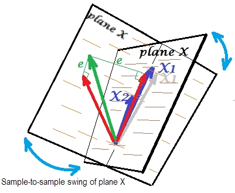

theme: Next, 4

# Survey of Machine Learning Methods

## Pedro Rodriguez

### CU Boulder PhD Student in Large-Scale Machine Learning

--- 

# Overview

* Short theoretical review of each method
* Strong and weak points of each method
* Compare out of the box performance on Rate My Professor

--- 

# Models

* Linear Models
* Decision Trees
* Random Forests
* $$X$$ is training data (design matrix), $$y$$ is targets

---

# Linear Regression

---

# Linear Regression

Find coefficients $$w$$ such that the mean squared error is minimized:


--- 

# Objective Function

$$
\min_w ||Xw-y||_2^2
$$

* Where could this go wrong?

---

# Correlation in Design Matrix

* What if there are correlated variables in $$X$$?
* The matrix $$X$$ would be nearly singular
* Singular matrix equivalent to determinant equal to zero

$$
\begin{bmatrix}
    0 & 0 \\
    1 & 1
\end{bmatrix}
$$

---

# Slight Correlation in $$X$$


* The plane $$X$$ is well defined

---

# Perfect Correlation in $$X$$


* The plane $$X$$ disappears since only one variable is needed to explain $$y$$

---

# Near Perfect Correlation in $$X$$

* Slight divergence in $$X_1$$ causes large shift in plane $$X$$



---

# Example

Even a very slight perturbation in $$X$$ causes a huge shift

```python
In [1]: from sklearn.linear_model import LinearRegression
In [2]: m = LinearRegression(fit_intercept=False)
In [3]: m.fit([[0, 0], [1, 1]], [1, 1])
Out[3]: LinearRegression(copy_X=True, fit_intercept=False, n_jobs=1, normalize=False)

In [4]: m.coef_
Out[4]: array([ 0.5,  0.5])

In [17]: m.fit([[.001, 0], [1, 1]], [1, 1])
Out[17]: LinearRegression(copy_X=True, fit_intercept=False, n_jobs=1, normalize=False)

In [18]: m.coef_
Out[18]: array([ 1000.,  -999.])
```

---

# Fixing This

* The problem is that there are no other optimization constraints
* Next two models impose constraints
  * Ridge Regression
  * Lasso Regression

---

# Ridge Regression

---

# Ridge Regression

* Optimizes the same least squares problem as linear regression with a penalty on size of coefficients

$$
\min_w ||Xw-y||_2^2+\alpha ||w||_2^2
$$

---

# Example

```python
In [1]: from sklearn.linear_model import Ridge
In [2]: r = Ridge(fit_intercept=False)
In [3]: r.fit([[0, 0], [1, 1]], [1, 1])
In [4]: r.coef_
Out[4]: array([ 0.33333333,  0.33333333])

In [5]: r.fit(np.array([[.001, 0], [1, 1]]), [1, 1])
In [6]: r.coef_
Out[6]: array([ 0.33399978,  0.33300011])
```

---

# Lasso Regression

---

# Lasso Regression

* Optimize least squares with penalty for too many important coefficients
* Prefers models with fewer parameter values due to $$l_1$$ norm

$$
\min_w\frac{1}{2n}||Xw-y||_2^2+\alpha ||w||_1
$$

---

# Compare on Rate My Professor

```python
import pandas as pd
from sklearn.cross_validation import train_test_split
from sklearn.feature_extraction.text import CountVectorizer
from sklearn.pipeline import Pipeline
from sklearn.grid_search import GridSearchCV
from sklearn.metrics import mean_squared_error
from sklearn.linear_model import LinearRegression, Ridge, Lasso

data = pd.read_csv('train.csv')
data['comments'] = data['comments'].fillna('')
train, test = train_test_split(data, train_size=.3)

 def test_model(model, ngrams):
    pipeline = Pipeline([
            ('vectorizer', CountVectorizer(ngram_range=ngrams)),
            ('model', model)
    ])

    cv = GridSearchCV(pipeline, {}, scoring='mean_squared_error')
    cv = cv.fit(train['comments'], train['quality'])
    validation_score = model.best_score_
    predictions = model.predict(test['comments'])
    test_score = mean_squared_error(test['quality'], predictions)
    return validation_score, test_score
```

---

# Compare on Rate My Professor

```python
import itertools

models = [('ols', LinearRegression()), ('ridge', Ridge()), ('lasso', Lasso())]
ngram_ranges = [(1, 1), (1, 2), (1, 3)]

scores = []
for m, ngram in itertools.product(models, ngram_ranges):
    name = m[0]
    model = m[1]
    validation_score, test_score = test_model(model, ngram)
    scores.append({'score': -validation_score, 'model': name, 'ngram': str(ngram), 'fold': 'validation'})
    scores.append({'score': test_score, 'model': name, 'ngram': str(ngram), 'fold': 'test'})

import seaborn as sb
df = pd.DataFrame(scores)
```

---

# RMP: Dimensionality

Using `CountVectorizer` with 1, 2, and 3 grams

* 20% of training data
* 1-gram: ~50,000
* 2-gram: ~650,000
* 3-gram: ~2,500,000
* Can you guess which model did the best?

---

# Comparison of Models


* Ideas on why?

---

# Decision Trees

---

# Decision Trees: Classification


---

# Decision Trees: Classification


---

# Decision Trees

* Recursively: pick the $$x_i$$ which best splits the data and create a split
* Stop when the data is pure or knowledge gain is small/zero

---

# Gini Impurity

* Randomly assign classes according to frequency of labels
* How often a randomly selected element has wrong class
* $$f_i$$: fraction of items labeled with class $$i$$
* $$i\in\{1,2,...,J\}$$, $$J$$ is the number of classes

$$
I_g(f)=\sum_{i=1}^Jf_i(1-f_i)
$$

---

# Example

* Suppose $$J=2$$
* $$f_1=.5$$ and $$f_2=.5$$ then $$I_g(f)=.5^2+.5^2=.5$$ 
* $$f_1=.1$$ and $$f_2=.9$$ then $$I_g(f)=.1\cdot .9+.1\cdot .9=.18$$ 
* Pick the variable which produces the highest Gini Impurity
* There are other similar metrics

---

# Decision Trees for Regression

* No classes, numeric target
* How can we adapt to this using a similar idea?

---

# Decision Trees for Regression

* Switch Gini Impurity with Standard Deviation Reduction
* Find splits that minimize the sum of squared errors (promote homogeneity)
* $$\bar{y_i}$$ is mean target in set $$S_i$$

$$
SSE=\sum_{i\in S_1}(y_i-\bar{y_1})^2+\sum_{i\in S_2}(y_i-\bar{y_2})^2
$$

---

# Growing a Regression Tree

* Split the data on each attribute
* Categorical is simple, Ordinal values: sort and split values of attribute
* Calculate the change in standard deviation
* Find the attribute that reduces standard deviation the most

More complete explanation by CMU[^1][^2]

[^1]: [Regression Tree Notes](http://www.stat.cmu.edu/~cshalizi/350/lectures/22/lecture-22.pdf)

[^2]: [Additional Notes](http://www.stat.cmu.edu/~cshalizi/350-2006/lecture-10.pdf)

---

# Challenges with Decision Trees

* Prone to overfitting: low bias, very high variance
* Bias: trees find the relevant relations
* Variance: Sensitive to noise/variance in training set


---

# Tree Overfitting on RMP

```python
from sklearn.tree import DecisionTreeRegressor
tree_scores = []
for i in [5, 50, 100, 150, 200, 250, 300, 350]:
    validation_score, test_score = test_model(DecisionTreeRegressor(max_depth=i), (1, 1))
    tree_scores.append({'Max Depth': i, 'score': -validation_score, 'fold': 'validation'})
    tree_scores.append({'Max Depth': i, 'score': test_score, 'fold': 'test'})

tree_df = pd.DataFrame(tree_scores)
g = sb.barplot(x='Max Depth', y='score', hue='fold', data=tree_df, ci=None)
plt.legend(loc='upper left')
plt.ylabel('MSE Score')
g.savefig('plot-tree-overfitting.png', format='png', dpi=300)
```

---

# Tree Overfitting on RMP


---

# Random Forests

---

# Random Forests

* Use predictive power of decision trees without issue of overfitting
* Idea: fit many trees on different subsets of features and training examples then vote on the answer
* Generally one of the best off-the-shell learning methods

---

# Tree Bagging

* $$X=x_1,...,x_n$$ with $$Y=y_1,...,y_n$$
* Given $$B$$ bags

```python
for b in range(B):
    # sample with replacement n training examples: Xb, Yb
    # Train a decision tree fb on Xb, Yb

# Save all the trees for later
```

---

# Tree Bagging and Random Forests

After training, predictions for new $$x'$$ are made using a vote

$$
\hat{f}=\frac{1}{B}\sum_{b=1}^B\hat{f_b}(x')
$$

* Creating random subsets of features for each tree results in a Random Forest

---

# Random Forests on RMP

```python
from sklearn.ensemble import RandomForestRegressor

rf_scores = []
for i in [10, 25, 50, 75, 100]:
    validation_score, test_score = test_model(
        RandomForestRegressor(max_depth=i, n_jobs=-1),
        (1, 1)
    )
    rf_scores.append({'Max Depth': i, 'score': -validation_score, 'fold': 'validation'})
    rf_scores.append({'Max Depth': i, 'score': test_score, 'fold': 'test'})
```

---

# Random Forests on RMP


---

# Summary

* Linear Models: Ordinary Least Squares, Ridge, and Lasso
* Decision Trees
* Random Forests
* Code examples of all of these using 20% data as training
* Best out-of-box model: Random Forests (~4.0)

---

# Questions?

* More About Pedro Rodriguez: [pedrorodriguez.io](http://pedrorodriguez.io)
* [github.com/Entilzha](https://github.com/EntilZha)
* Colorado Data Science Team: [codatascience.github.io](https://codatascience.github.io)
* Code at [github.com/CoDataScience/rate-my-professor](https://github.com/CoDataScience/rate-my-professor)

